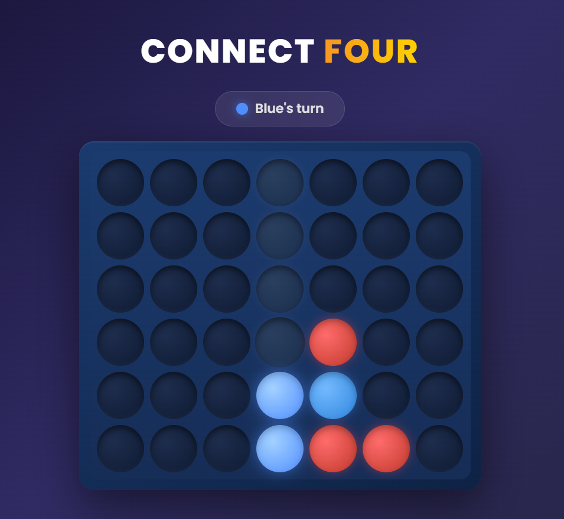
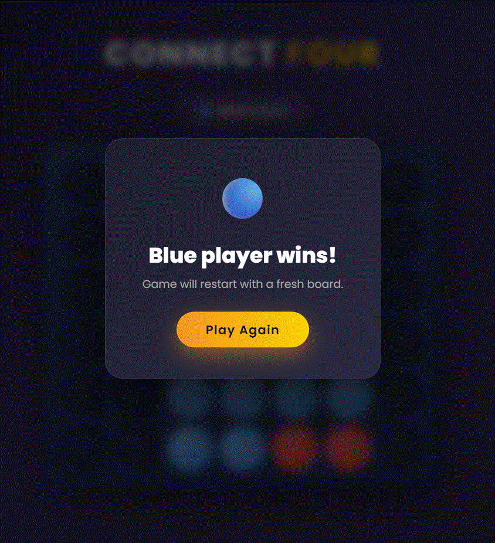

# Connect Four — Vanilla JS

> A fully playable Connect Four game built from scratch with **zero frameworks** — pure HTML, CSS, and JavaScript, structured with the **MVC design pattern**.

🎮 **[Play Live Demo](https://connect-four-vanilla.vercel.app/)**

---

## Screenshots

| Gameplay | Win Screen |
|----------|------------|
|  |  |

---

## Skills Demonstrated

- **DOM manipulation** — board rendered and updated entirely via JavaScript, no templating library
- **MVC architecture** — clean separation into `Data.js` (state), `View.js` (rendering), `Controller.js` (logic)
- **CSS animations** — smooth piece-drop physics with `@keyframes` and `cubic-bezier` easing at 60fps
- **Algorithm design** — win detection across all 4 directions (horizontal, vertical, both diagonals)
- **Responsive design** — playable on desktop and mobile with no external UI framework
- **Modern tooling** — Vite build pipeline for dev server and optimized production output

---

## Tech Stack

| Layer | Technology |
|-------|-----------|
| Language | Vanilla JavaScript (ES6 Modules) |
| Styling | Pure CSS3 — gradients, glassmorphism, animations |
| Build | Vite v5 |
| Fonts | Google Fonts (Poppins) |
| Deployment | Vercel |

---

## Architecture

```
js/
├── Controller.js   # Event handling, game flow, restart logic
├── Data.js         # Board model (6×7 grid), Cell/Row classes, win detection
└── View.js         # DOM updates, drop animations, modal display
```

The three modules communicate through clear interfaces — no global state, no spaghetti code.

---

## Run Locally

```bash
npm install
npm run dev
```
- **Modal:** Frosted glass effect with blur backdrop
- **Typography:** Poppins font for modern, clean appearance

## 🚀 Deployment

Ready for deployment to:
- **Netlify** — Drag & drop the `dist/` folder
- **Vercel** — Connect GitHub repo for auto-deploys
- **GitHub Pages** — Build and push to `gh-pages` branch
- Any static hosting service

## 📝 Code Quality

- **Modular Structure** — Clear separation between data, view, and controller
- **Well-Commented CSS** — Every section labeled and organized
- **No Dependencies** — Only Vite for bundling (fully configurable)
- **ES6 Modules** — Clean import/export syntax

## 🎓 Learning Outcomes

This project demonstrates:
- ✅ Vanilla JavaScript (ES6) — modules, classes, event handling
- ✅ CSS3 — animations, gradients, transforms, media queries
- ✅ DOM manipulation — efficient selection and updates
- ✅ Game logic — win detection algorithms
- ✅ Build tooling — Vite configuration & optimization
- ✅ Responsive design — mobile-first thinking
- ✅ State management — clean architecture patterns

## 🔮 Future Enhancements

- Add AI opponent (minimax algorithm)
- Score tracking across multiple games
- Sound effects & haptic feedback
- Multiplayer over WebSocket
- Dark/Light theme toggle
- Local storage for game history

## 📄 License

Open source — feel free to use and modify.

---

**Made with ❤️ in vanilla JavaScript**

**Live:** https://connect-four-vanilla.vercel.app/
